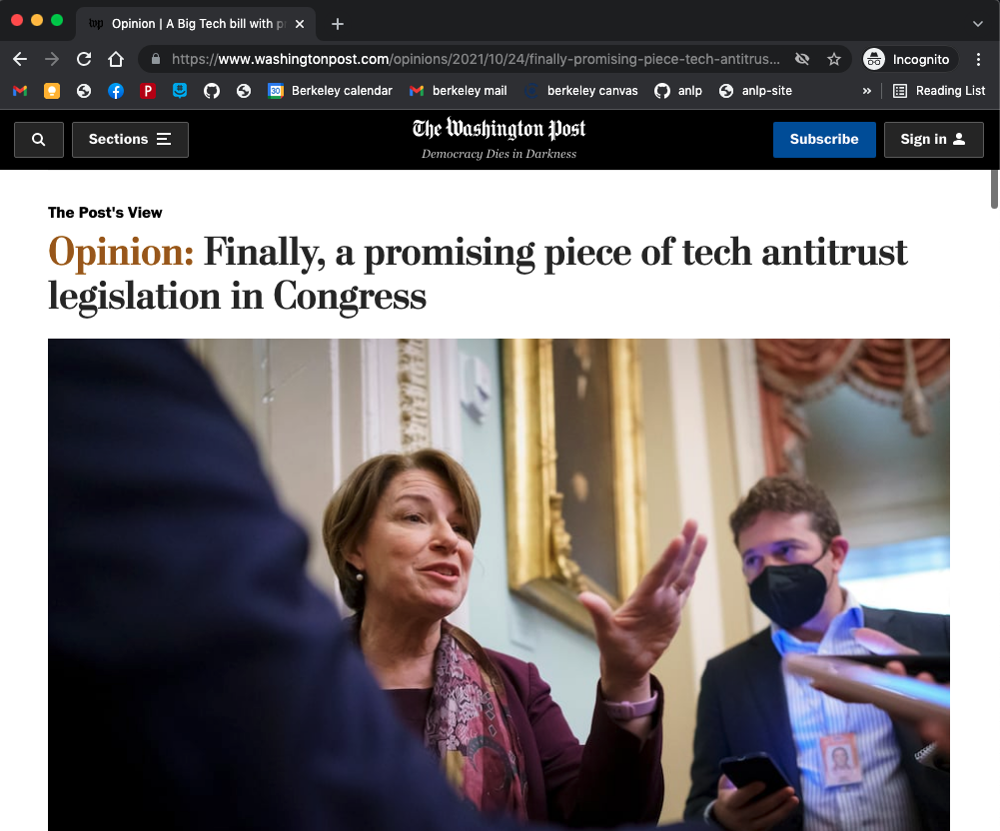
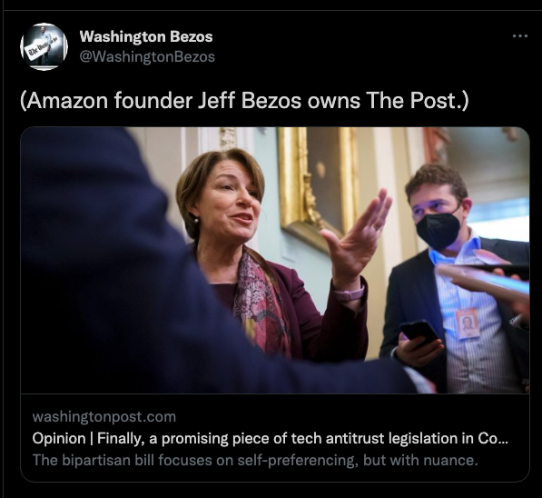
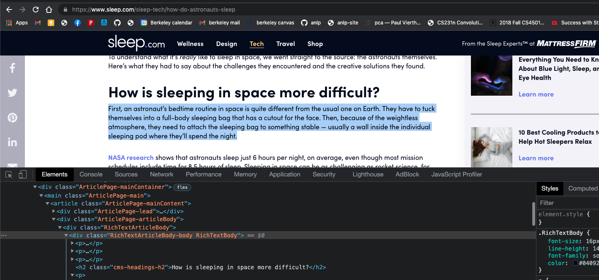
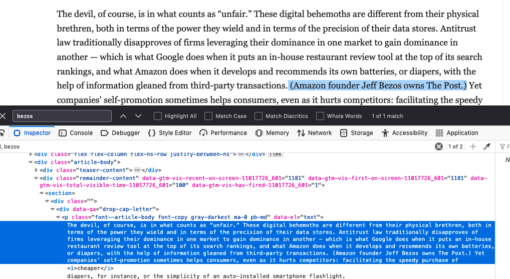
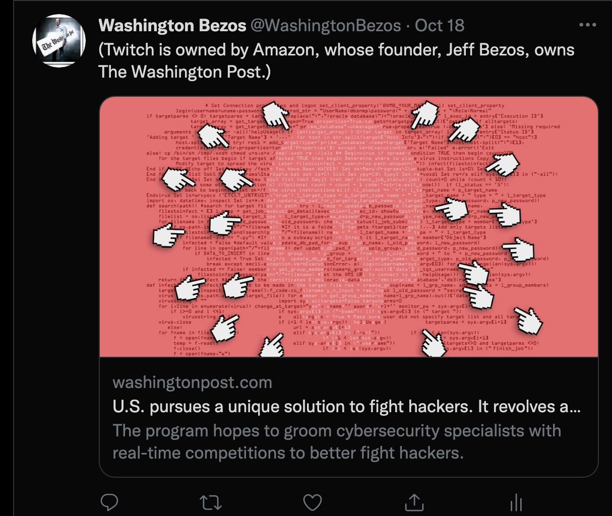
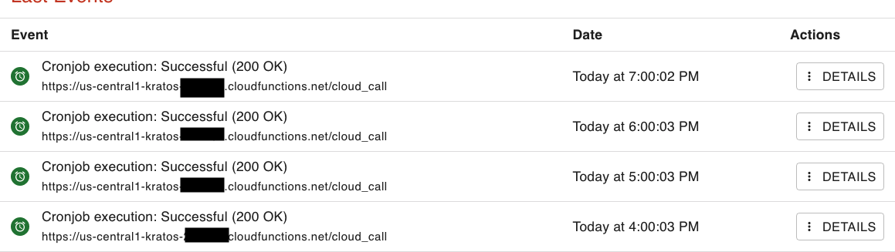
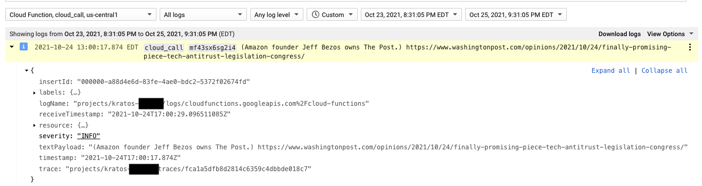

## Example + Code walkthrough:

for code, follow along! - https://github.com/timschott/kratos/blob/master/wapo.py

## Problem setup:

*Find every article that contains a mention of Bezos*


*extract the note* 


*tweet*!



## Finding Articles with the News API

Every hour, call the News API's Everything [endpoint](https://newsapi.org/docs/endpoints/everything) and search the text of every *Washington Post* story for mentions of "Bezos":

```perl
GET https://newsapi.org/v2/everything
	?q=+Bezos
	&sources=the-washington-post
	&date_from=2021-10-24T18:00:01
	&date_to=2021-10-24T19:00:00
	&sort_by=publishedAt
```

cool - `+` attached to "Bezos" means an exact match *must* occur -- easy, free filtering!
\
`api_call()` makes the request and returns the Response [(line 171)](https://github.com/timschott/kratos/blob/master/wapo.py#L171)

## Parse API response

example response for this article:
```json
{
   "status":"ok",
   "totalResults":1,
   "articles":[
      {
         "title":"Opinion | A Big Tech bill with promise comes to Congress - The Washington Post",
         "url":"https://www.washingtonpost.com/opinions/2021/10/24/finally-promising-piece-tech-antitrust-legislation-congress/",
         "urlToImage":"...",
         "publishedAt":"2021-10-24T12:12:12Z",
         "content":"The … [+2142 chars]",
        "source":{
            "id":"the-washington-post",
            "name":"The Washington Post"
         },
        "author":"...",
        "description":"...",
      }
   ]
}
```

we care about the title and URL --

`get_article_dict()` extracts the `title` and `url` fields [(line 198)](https://github.com/timschott/kratos/blob/master/wapo.py#L198). 

## Scrape article text

now that we have the URL, scrap the article DOM with BeautifulSoup to extract the text

It would be great if their DOM was ... well-organized 

Like this site I made at Brightspot:



But, *Washington Post* `<div>`'s divide into `teaser-content` then `remainder-content`...



So, `get_article_text()` grabs all relevant "body" paragraphs [(line 237)](https://github.com/timschott/kratos/blob/master/wapo.py#L237).

## Searching article text for the "disclosure"

Now, we have to find the disclosure note. 

`find_note()` takes in the list of article paragraphs and searches through their contents [(line 316)](https://github.com/timschott/kratos/blob/master/wapo.py#L316)

Challenge: they don't have a standardized convention for the note, especially when his name is directly part of the story. 

examples:




Strategy: Iterate over every paragraph, regex for all the known versions of the note.

**Most popular**: "(Amazon founder Jeff Bezos owns the Washington Post.)"
  * this case behind the scenes: regex for text contained in parens, look at each for "Bezos" [(line 343)](https://github.com/timschott/kratos/blob/master/wapo.py#L343)
  * for our example article...
  * >"...information gleaned from third-party transactions. **(Amazon founder Jeff Bezos owns The Post.)**"
    * bingo! return the note!
  
By far the most time-consuming part of the making the bot ... + great, relevant experience for Data Science

## Tweet time!

Format a in `get_tweets` [(line 428)](https://github.com/timschott/kratos/blob/master/wapo.py#L428):

contents - Note we found in the article + the URL

Thanks to [social preview](https://developer.twitter.com/en/docs/twitter-for-websites/cards/guides/getting-started), I don't have to do any formatting!

This method returns a list, that contains the tweet. 

For our example, it's a singleton: 
```python
['(Amazon founder Jeff Bezos owns The Post.) https://www.washingtonpost.com/opinions/2021/10/24/finally-promising-piece-tech-antitrust-legislation-congress/']
```

Use Twitter API to update our followers!

`send_tweets()` [(line 442)](https://github.com/timschott/kratos/blob/master/wapo.py#L442)


## Brief Automation overview

Automation aspect is fairly simple ... Use cron-job.org to hit the endpoint every hour!



The log from when this tweet actually got sent out!

